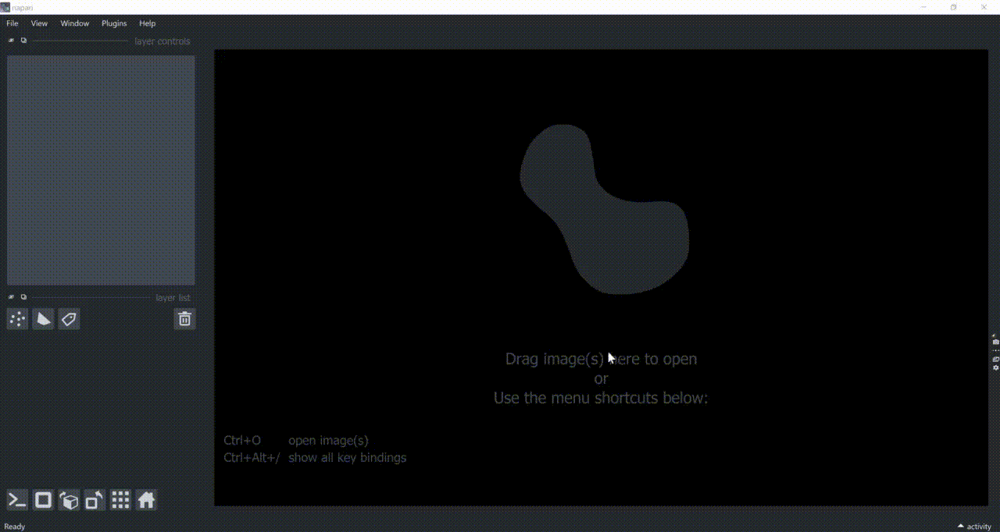

# napari-metroid

This napari plugin is an adaptation of [metroid](https://github.com/zoccoler/metroid). It creates several regions of interest of similar area over cells in a fluorescence video (2D+time). It then gets ROIs means over time and performs signal denoising: fixes photobleaching and separates signal from noise by means of blind source separation (with or without wavelet filtering).

----------------------------------

This [napari] plugin was generated with [Cookiecutter] using [@napari]'s [cookiecutter-napari-plugin] template.

<!--
Don't miss the full getting started guide to set up your new package:
https://github.com/napari/cookiecutter-napari-plugin#getting-started

and review the napari docs for plugin developers:
https://napari.org/plugins/stable/index.html
-->
## Full preview

Below is a full demonstration of using napari-metroid. It shows the following:
  * Open sample data;
  * Create cell mask;
  * Split mask into ROIs of similar area;
  * Get ROIs signals over time and plots two of them;
  * Remove photobleaching;
  * Remove noise:
    * Employ ICA to decompose ROIs signals into independent components;
    * Plot 4 components;
    * Select the component of interest (source);
    * Perform inverse transformation with selected source;
        

## Installation

Download and install [Anaconda](https://www.anaconda.com/products/individual) or [Miniconda](https://docs.conda.io/en/latest/miniconda.html#).

Create a new conda environment:

    conda create -n metroid-env python=3.9

Install napari, e.g. via pip:

    pip install "napari[all]"

Install `napari-metroid` via [pip]:

    pip install napari-metroid

To install latest development version :

    pip install git+https://github.com/zoccoler/napari-metroid.git

## Contributing

Contributions are very welcome. Tests can be run with [tox], please ensure
the coverage at least stays the same before you submit a pull request.

## License

Distributed under the terms of the [BSD-3] license,
"napari-metroid" is free and open source software

## Issues

If you encounter any problems, please [file an issue] along with a detailed description.

[napari]: https://github.com/napari/napari
[Cookiecutter]: https://github.com/audreyr/cookiecutter
[@napari]: https://github.com/napari
[MIT]: http://opensource.org/licenses/MIT
[BSD-3]: http://opensource.org/licenses/BSD-3-Clause
[GNU GPL v3.0]: http://www.gnu.org/licenses/gpl-3.0.txt
[GNU LGPL v3.0]: http://www.gnu.org/licenses/lgpl-3.0.txt
[Apache Software License 2.0]: http://www.apache.org/licenses/LICENSE-2.0
[Mozilla Public License 2.0]: https://www.mozilla.org/media/MPL/2.0/index.txt
[cookiecutter-napari-plugin]: https://github.com/napari/cookiecutter-napari-plugin

[file an issue]: https://github.com/zoccoler/napari-metroid/issues

[napari]: https://github.com/napari/napari
[tox]: https://tox.readthedocs.io/en/latest/
[pip]: https://pypi.org/project/pip/
[PyPI]: https://pypi.org/
